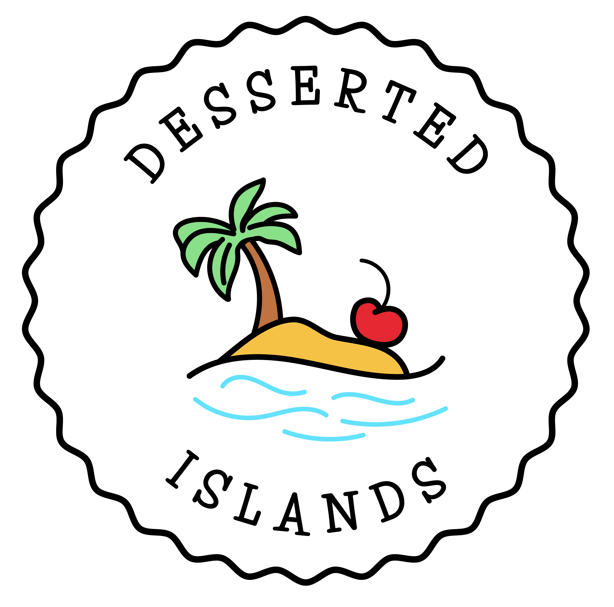
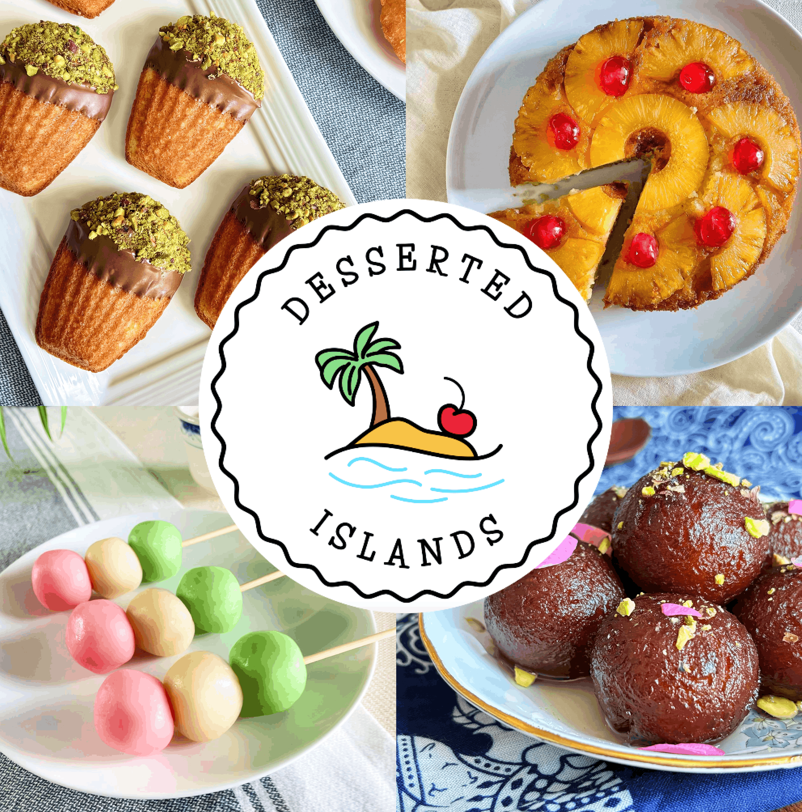

# Desserted Islands

	

**What do the world's island countries eat for dessert?** Desserted Islands is a baking project and interactive map exploring desserts from islands around the world.

Visit the live site at [dessertedislands.co.uk](https://www.dessertedislands.co.uk), browse the map, and follow each bake back to its Instagram post. Check out the main [Instagram](https://www.instagram.com/desserted_islands/).

## What it does

- Shows island countries and their bake status on an interactive map.
- Links completed bakes to their Instagram posts.
- Includes a gallery and background on the project.
- Provides an authenticated form for adding posts.

## Built with

- React and TypeScript
- Leaflet and [React-Leaflet](https://react-leaflet.js.org/) for the map
- Netlify Functions for the data API
- MongoDB for data storage
- Netlify Identity for access to admin forms
