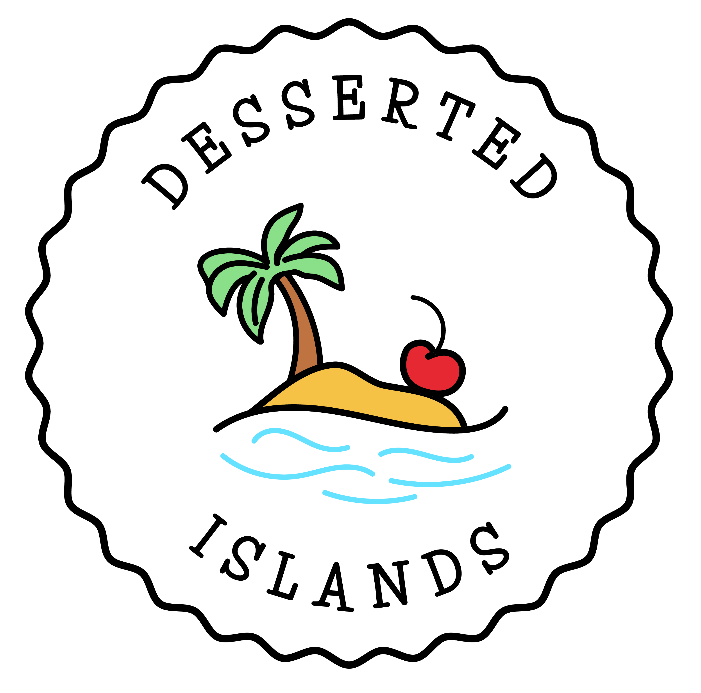

# Desserted Islands

What do the world's 94 island countries eat for dessert? Well....

[🏝🍰🍒 Click to find out 🏝🍰🍒](https://www.dessertedislands.co.uk)

This site is an interactive map that links to delicious dessert recipes for (most...) of the world's islands. The desserts are all created (i.e. baked, cooked, fried, steamed...) by me and hosted on my [Instagram](https://www.instagram.com/desserted_islands/).

It's a React app, and uses Leaflet to create the base for the customized map (relying on [React-Leaflet](https://react-leaflet.js.org/) components).
